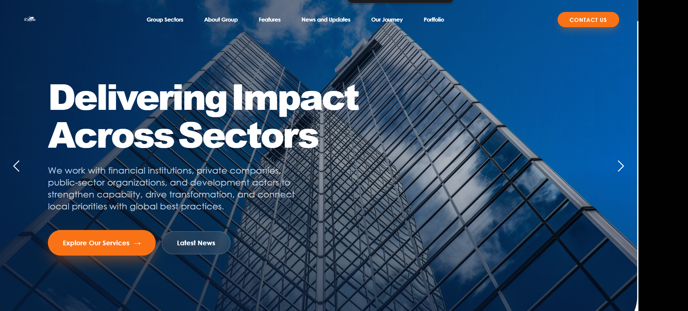

# i-Capital Africa Institute — Group Website

Official website for **The i-Capital Africa Institute**, delivering impact across sectors by working with financial institutions, private companies, public-sector organizations, and development actors across Africa.



## Tech Stack

- [Next.js 15](https://nextjs.org/) (App Router)
- [React](https://react.dev/) + [TypeScript](https://www.typescriptlang.org/)
- [Tailwind CSS](https://tailwindcss.com/)
- [Apollo Client](https://www.apollographql.com/docs/react/) + [Strapi CMS](https://strapi.io/) (GraphQL)
- [Framer Motion](https://www.framer.com/motion/) & [Swiper](https://swiperjs.com/)

## Getting Started

Install dependencies and run the development server:

```bash
pnpm install
pnpm dev
```

Open [http://localhost:3000](http://localhost:3000) in your browser.

### Other Scripts

```bash
pnpm build    # Production build
pnpm start    # Start production server (port 17000)
pnpm lint     # Run ESLint
pnpm codegen  # Generate GraphQL types
```

## Project Structure

```
src/
├── app/           # Next.js App Router pages (home, news, etc.)
├── components/    # Reusable UI components
├── graphql/       # GraphQL queries & mutations
├── lib/           # Server utilities & helpers
└── utils/         # Shared utility functions
```

## Environment

Configure your Strapi GraphQL endpoint and other required variables in `.env.local` before running locally.

## Deploy

The site can be deployed to any Node.js hosting platform that supports Next.js. See the [Next.js deployment docs](https://nextjs.org/docs/deployment) for details.
